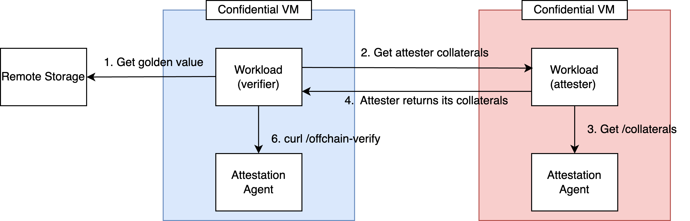
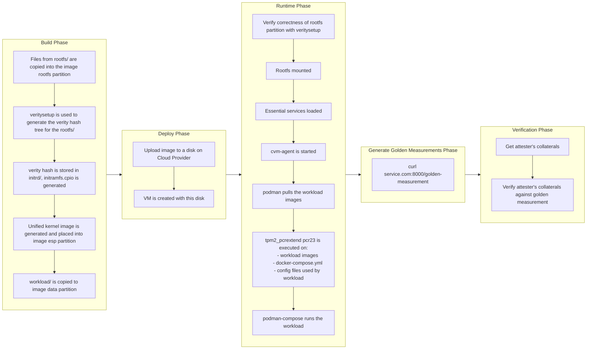

# cvm-base-image

## Prerequisites

- Ensure that you have enough permissions on your CSP to create virtual machines, disks, networks, firewall rules, buckets/storage accounts and service roles.

- You need the cli for the cloud provider you want to deploy on (either az cli, gcloud cli or aws cli)
   - az cli:
     - Download: [Guide](https://learn.microsoft.com/en-us/cli/azure/install-azure-cli)
     - Login: [Guide](https://learn.microsoft.com/en-us/cli/azure/authenticate-azure-cli)
   - gcloud cli:
     - Download: [Guide](https://cloud.google.com/sdk/docs/install)
     - Login: [Guide](https://cloud.google.com/sdk/docs/initializing)
   - aws cli:
     - Download: [Guide](https://docs.aws.amazon.com/cli/latest/userguide/getting-started-install.html)
     - Login: [Guide](https://docs.aws.amazon.com/cli/latest/userguide/getting-started-quickstart.html)

## Configure the `workload/` folder

### 1. Create asymmetric keypairs
>[!Note]
> This step doesn't have to be run yet as the image signing feature is not ready.

Create one or more asymmetric keypairs, which will be used for the following steps:
  - [Signing the docker images](#2-sign-the-docker-images-that-will-be-used)
  - [Signing the golden measurements](#2-sign-the-golden-measurements)
```bash
# ECC key
openssl ecparam -genkey -name prime256v1 -noout -out private.pem
openssl ec -in private.pem -pubout -out public.pem

# RSA key
openssl genpkey -algorithm RSA -out private.pem -pkeyopt rsa_keygen_bits:2048
openssl rsa -in private.pem -pubout -out public.pem
```

### 2. Sign the docker images that will be used

TODO

### 3. Modify the `workload/` folder:
- In the folder, there are 3 things - a file called `docker-compose.yml` and 2 folders called `config/` and `secrets/`.
  - `docker-compose.yml` : This is a standard docker compose file that can be used to specify your workload. However, do note that podman-compose will run this file instead of docker-compose. While this generally works fine, there are some caveats:
    - Please see this [issue](https://github.com/containers/podman-compose/issues/575) regarding podman-compose and specific options in `depends_on`.
    - Images that are hosted on docker's official registry must be prefixed with `docker.io/`.
  - `config/` : Use this folder to store any files that will be mounted and used by the container. All the files in this folder will be measured by the cvm-agent into the TPM PCR before the container runs.
  - `secrets/`: Use this folder to store any files that will be mounted and used by the container, but should not be measured. Examples include cert private keys, or database credentials.
- Additionally, if you wish to load local images, simply put the `.tar` files for the container images into the `workload/` directory itself. This will be automatically detected and loaded.

> [!IMPORTANT]
> If you have created any asymmetric keypairs in [Step 1](#1-create-asymmetric-keypairs), please also place the public keys into `workload/config/`.
> This is to ensure that the public keys will also be measured into the TPM PCR, and prevents against tampering.


### 4. Configure the cvm-agent and Security Policy
The CVM agent runs inside the CVM and is responsible for VM management, workload measurement, and related tasks. The tasks that it is allowed to perform depends on a security policy, which can be configured by the user.

The default security policy can be found in [workload/config/cvm_agent/cvm_agent_policy.json](workload/config/cvm_agent/cvm_agent_policy.json):
```json
{
    "cvm_config": {
        "emulation_mode" :{
            "enable": false,
            "cloud_provider": "azure",
            "tee_type": "snp" ,
            "emulation_data_path": "./emulation_mode_data",
            "enable_emulation_data_update": true
        },

        "https_server" :{
            "enable_workload_update_endpoint": true,
            "enable_maintenance_endpoint": false,
            "enable_tls": true,
            "enable_workload_update_auth": true
        },

        "container_api" : {
            "container_engine": "podman",
            "container_owner": "automata"
        },

        "maintenance_mode" : {
            "signal" : "SIGUSR2",
            "ssh_port_on_host": "2222"
        }
    }
}
```
The default policy is conservative, prioritizes security and can be used as it is. However, if you wish to change any settings, a detailed description of each policy option can be found in [this document](docs/cvm-agent-policy.md).

## Deploying the workload onto the Cloud Provider
Run the CLI to deploy the disk to the cloud provider.

### Deploying to Azure
```bash
./cvm-cli deploy-azure --resource_group <group> --storage_account <storage_account> --gallery_name <gallery_name> --additional_ports "80,443" --vm_name <name> --vm_type "<type>" --region "<region>"
```
The following **must** be provided:
- storage_account: The name of the storage account to upload the cvm disk into.
  - **Name must be between 3-24 characters and globally unique across Azure.**
- gallery_name: The name of the shared image gallery to use. 
  - **Name must be between 1-80 characters, made up of only letters, numbers and hyphens, and unique within the Subscription**
- resource_group: The name of the resource group to deploy the VM into.

The following parameters are optional, and default to:
- vm_name: cvm_test
- vm_type: Standard_DC2es_v5
- region: East US 2
- additional_ports: “”


### Deploying to GCP
```bash
./cvm-cli deploy-gcp --additional_ports "80,443" --vm_name <name> --region "<region>" --project_id <project id> --bucket <bucket_name> --vm_type "<type>"
```

The following **must** be provided:
- project_id: Name of the project to deploy into
- bucket : Name of the GCP bucket which will be used to temporarily store the disk image.

The following parameters are optional, and default to:
- vm_name: cvm-test
- region: asia-southeast1-b
- vm_type: c3-standard-4
- additional_ports: “”

### Deploying to AWS
```bash
./cvm-cli deploy-aws --additional_ports "80,443" --vm_name <name> --region "<region>" --bucket <bucket_name> --vm_type "<type>"
```

The following **must** be provided:
- bucket : Name of the S3 bucket which will be used to temporarily store the disk image. This **must** be in the same region as the VM.

The following parameters are optional, and default to:
- vm_name: cvm-test
- region: us-east-2
- vm_type: m6a.large
- additional_ports: “”

> [!Warning]
> AWS currently has a known issue where the [boot process may intermittently hang for an SEV-SNP VM](https://bugs.launchpad.net/cloud-images/+bug/2076217). If you're unable to curl the APIs provided in the next section, please reboot the VM.


## Signing and Publishing the Golden Measurements
> [!IMPORTANT]
> The golden measurements are required for the [verification phase](#verifying-the-image-and-workload), as they serve as the reference against which verifiers compare an attester's collaterals to confirm alignment with a known, expected state. The publisher of the workload should create and publish the golden measurement for verifiers to reference.

- Off-chain: After you have deployed the CVM on the cloud provider in the previous step, you should now have a file `_artifacts/golden-measurement.json`.
- On-chain: TODO


### 1. Sign the golden measurements

> [!NOTE]
> This step is optional, and depends on where the golden measurement will be hosted. For off-chain verification, it is recommended to sign the golden measurement if it will be hosted somewhere untrusted, like on a cloud provider's S3 bucket.

- For off-chain:
  - Step 1: Sign the golden measurement. A reference helper script has been provided in this repo:
   ```bash
   ./json_sig_tool.py sign _artifacts/golden-measurement.json private.pem -o signed-golden-measurement.json
   ```
  - Step 2: (Optional, Sanity check) Verify the signature
   ```bash
   ./json_sig_tool.py verify signed-golden-measurement.json public.pem
   ```
- For on-chain: TODO

### 2. Publish the golden measurements
Publish the golden measurements for verifiers to reference.

- For off-chain:
  - The golden measurements can be stored anywhere that a verifier can retrieve them, for example, on S3 storage.
  - If the verifier is hosted externally from a TEE environment, the golden measurement can be hosted there as well.


- For on-chain: TODO.


## Verifying the image and workload
### Off-chain verification
To verify that the workload is running a CVM with the expected measurements, the verifier should undertake the following steps in general:
1. Retrieve the published golden measurements from remote.
   - Verify the signature on the golden measurement to ensure it can be trusted, if needed.
2. Retrieve collaterals from the workload running on the attester CVM.
   - As an example, the workload on the attester CVM can query the cvm-agent locally as follows:
     ```bash
     curl 127.0.0.1:7999/collaterals/1234
     ```
3. Verify the collaterals against the published golden measurements.
   - If the verifier runs within a TEE environment that is created from our cvm-image, the verifier can use the cvm-agent to verify the collaterals against the published golden measurements:
     ```bash
     # Assuming that the verifier saves the collaterals as collaterals.json:
     jq -s '{ golden_measurement: (.[1].golden_measurement | @json), collaterals: (.[0] | @json) }' collaterals.json signed-golden-measurement.json | curl -X POST 127.0.0.1:7999/offchain-verify -H "Content-Type: application/json" -d @-
     ```
   - If the verifier runs outside of a TEE environment, the [cvm-verifier SDK](https://github.com/automata-network/cvm-verifier) can be used to verify the collaterals against the golden-measurement:
     ```bash
     # Run the verifier. Assuming the verifier saves the collaterals as collaterals.json:
     cargo run --release --bin cvm-verifier collaterals.json golden-measurement.json
     ```


For a more concrete example of the verification workflow, please check out the [peer node verification workflow below](#example-peer-node-verification-workflow-off-chain).


### On-chain verification
```
TODO.
```

For more details on the APIs available on the cvm-agent, please check out [this document](docs/cvm-agent-api.md).


### Example: Peer Node Verification Workflow (Off-chain)


This use-case describes the remote attestation flow between two **Confidential Virtual Machines (VMs)**—an **attester** and a **verifier**—using **attestation agents** and optional **remote storage** for verification.


#### 🧩 Components

##### 🔐 Confidential VM (Attester)
- **Workload (attester):** Application that provides collaterals to **verifier** for verification.
- **Attestation Agent:** Retrieves attestation reports and platform-specific collateral (e.g., TCB info, certificates).

##### 🔎 Confidential VM (Verifier)
- **Workload (verifier):** Application that receives collaterals from **attester** and verifies the collaterals using its local **Attestation Agent**.
- **Attestation Agent:** Validates the integrity of the attester's collaterals using cryptographic operations.

##### 🗄️ Remote Storage
- Stores known-good reference values used by the verifier to compare against collaterals of **attester** (ie, the golden measurement).


#### 🔄 Attestation Flow
1. **Get Golden Value**  
  The **verifier workload** gets golden value of **attester workload** from **remote storage**.

2. **Initiates attestation request**  
   The **verifier workload** send the attestation req to **attester workload**.

3. **Collect Evidence**  
   The **attester workload** get the collaterals from its local **attestation agent** via `/collateral` endpoint.

4. **Respond to the attestation request**  
   The **attester workload** replies the verifier workload with its collaterals.

5. **Verify Evidence**  
   The **verifier workload** calls its **attestation agent** using `/offchain-verify` to perform cryptographic validation and verify trustworthiness.

#### ✅ Outcome

If verification succeeds, the **verifier** can trust the **attester's VM** and proceed with sensitive operations such as key sharing or secure computation.


## Updating the workload

If the workload requires an update (eg. such as a new image version), the following steps can be taken:
>[!Note]
> If the podman runtime is selected in the agent policy, volume and network cannot be updated using this method.


### 1. Remember to sign the docker images that will be used

Please refer to [this step](#2-sign-the-docker-images-that-will-be-used) for details.

### 2. Update the `workload/` folder:
Please refer to [this step](#3-modify-the-workload-folder) for details.

### 3. Update the workload
Run the following command to upload your updated workload to your deployed CVM:
```bash
./cvm-cli update-workload
```

## Architecture

### Trust Architecture


The diagram illustrates the trust architecture of our CVM Design from the lowest levels (hardware) all the way up to the highest levels (the workload). The vTPM is also cryptographically bound to the underlying Trusted Execution Environment (TEE) hardware in order to prevent replay attacks from malicious CVMs operating outside the trusted environment.

### Measured Boot


Measured boot captures and records cryptographic measurements of each step in the boot sequence, from VM launch all the way to workload initialization. Additionally, it securely extends these measurements into the TPM's Platform Configuration Registers (PCRs). The values extended into the PCRs can then be used to verify the integrity and trustworthiness of the entire boot process.

### Workload Architecture


Within the CVM, two primary programs run concurrently: the cvm-agent and the workload. The workload may leverage the cvm-agent to retrieve and verify attestations and measurements, as well as dynamically update itself when new versions become available. In this design, the cvm-agent functions similarly to a sidecar, providing optional services for attestation and verification without tightly coupling itself to the primary workload. 

The cvm-agent provides a HTTP API as a means of communication, and more details of its API can be found in [this document](docs/cvm-agent-api.md).


### Workflow from Image Build -> Deployment -> Measurement



## Troubleshooting

### Failed to deploy cvm on Azure due to network error

Q: Help! I got the following error when deploying the CVM on Azure:

```bash
$ ./cvm-cli deploy-azure \
  --additional_ports "80,443,2222" \
  --vm_name "tdx-cvm-demo" \
  --resource_group "$RG" \
  --vm_type "Standard_DC2es_v5" \
  --storage_account "$STORAGE_ACCOUNT" \
  --gallery_name "$GALLERY_NAME"
Deploying azure_disk.vhd with the following parameters:
🔹VM Name: tdx-cvm-demo
🔹Resource Group: cvm_testRg
🔹VM Type: Standard_DC2es_v5
🔹Additional Ports: 80,443,2222
🔹Storage Account: tdxcvm123
🔹Shared Image Gallery: tdxGallery
......
......
......
++ echo '⏳ Image replication + gallery image version in progress... this might take a while (8+ mins). Time to grab a coffee and chill ☕🙂'
⏳ Image replication + gallery image version in progress... this might take a while (8+ mins). Time to grab a coffee and chill ☕🙂
++ true
+++ az sig image-version show --resource-group cvm_testRg --gallery-name tdxGallery --gallery-image-definition tdx-cvm-demo-def --gallery-image-version 1.0.0 --query provisioningState -o tsv
++ state=Creating
++ [[ Creating == \S\u\c\c\e\e\d\e\d ]]
++ echo '⏳ Still provisioning... (state: Creating)'
⏳ Still provisioning... (state: Creating)
++ sleep 30
++ true
+++ az sig image-version show --resource-group cvm_testRg --gallery-name tdxGallery --gallery-image-definition tdx-cvm-demo-def --gallery-image-version 1.0.0 --query provisioningState -o tsv
++ state=Failed
++ [[ Failed == \S\u\c\c\e\e\d\e\d ]]
++ echo '⏳ Still provisioning... (state: Failed)'
⏳ Still provisioning... (state: Failed)
++ sleep 30
++ true
```

A: The error is due to network issues. To fix it, delete the resource group on Azure and redeploy the CVM again.
